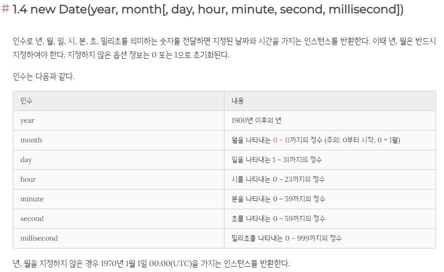
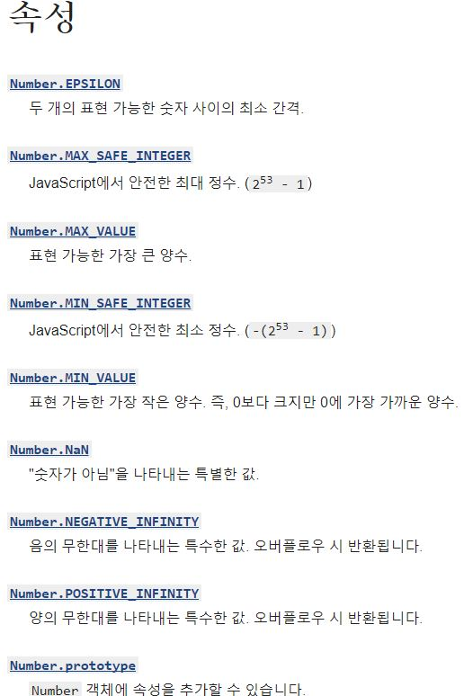
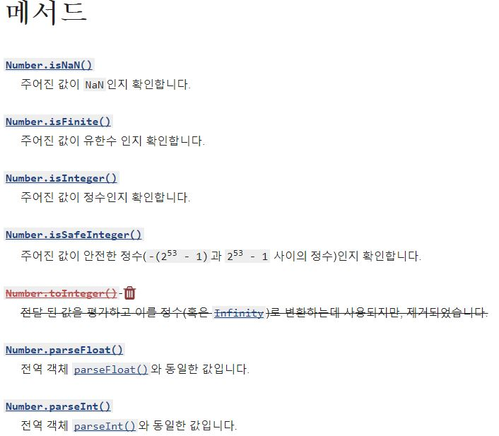
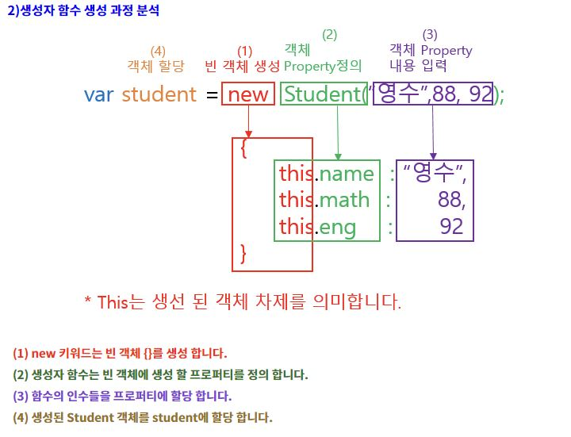
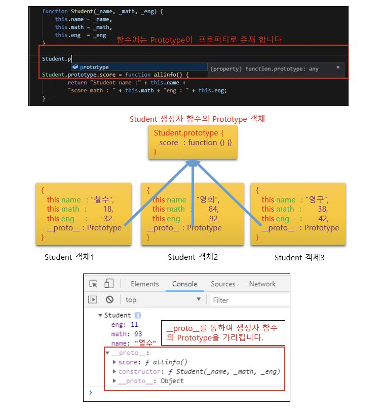

# 구본기 [201540202]

## [05월 18일]

---

## [05월 11일]

#### Date 객체

Date 객체는 생성자 함수이다. Date 생성자 함수는 날짜와 시간을 가지는 인스턴스를 생성한다. 생성된 인스턴스는 기본적으로 현재 날짜와 시간을 나타내는 값을 가진다. 현재 날짜와 시간이 아닌 다른 날짜와 시간을 다루고 싶은 경우, Date 생성자 함수에 명시적으로 해당 날짜와 시간 정보를 인수로 지정한다. <br />

new Date() : 현재 시간으로 Date 객체를 생성합니다 <br />
new Date(<유닉스 타임>) : 유닉스 타임(1970년 1월 1일 00시 00분 00초부터 경과한 밀리초)으로 Date 객체를 생성합니다. <br />
new Date(<시간 문자열>) : 문자열로 Date 객체를 생성합니다 <br />
new Date(<년>,<월-1>,<일>,<시간>,<분>,<초>,<밀리초>) : 시간요소(년,월-1,일,시간,분,초,밀리초)를 기반으로 Date 객체를 생성합니다 <br />
Month를 나타내는 '월'은 0부터 시작 : 0 > 1월, 11 > 12월 <br />

##### 메소드 활용

Date 객체 <br />
getOO() 형태 메소드, setOO() 형태 메소드 : FullYear, Month, Day, Hours, Minutes, Seconds 등 사용 <br />
 <br />
<br />
시간 더하기 : 현재 시간에 1년, 11개월, 7일을 더해 출력(현재 시간 : 2016년 8월 16일) <br />

>let date = new Date(); // 현재 시간을 구한다
>console.log(date); // 출력1
>date.setFullYear(date.getFullYear()+1);
>date.setMonth(date.getMonth()+11);
>date.setDate(date.getDate()+3);
>console.log(date); //출력2
>결과 : 2016-08-15T21:57:04,200Z 
>결과 : 2016-07-18T21:57:04,200Z 


---

## [05월 04일]

##### 자바스크립트 null

null은 '의도적으로 값이 없음'을 명시하기 위한 기본 데이터 타입이다.<br />
타입도 null이며,값도 null인 Primitive Type이다. <br />
즉 null은 객체가 아니다(기본타입이다) <br />
<br />

###### 표준 내장 객체

표준 내장 객체는 자바스크립트가 기본적으로 가지고 있는 객체들을 의미합니다. <br />
내장 객체가 중요한 이유는 프로그래밍을 하는데 기본적으로 필요한 도구들이기 떄문입니다. <br />
자바스크립트는 아래와 같은 내장 객체를 가지고 있습니다.<br />
>Object <br />
>Function <br />
>Array <br />
>String <br />
>Boolean <br />
>Number <br />
>Math <br />
>Date <br />
>RegExp <br />

---

참고 사이트 = https://developer.mozilla.org/ko/docs/Web/JavaScript/Reference/Global_Objects <br />

#### Number 객체

Number 객체는 숫자 값으로 작업할 수 있게 해주는 래퍼wrapper 객체입니다. Number 객체는 Number() 생성자를 사용하여 만듭니다. 원시 숫자 자료형은 Number() 함수를 사용해 생성합니다. <br />

Number 객체의 주된 용도는 다음과 같습니다. <br />
* 만약 인수를 숫자로 변환할 수 없으면 NaN을 리턴합니다.
* 생성자로써 사용하지 않으면(new 연산자를 사용하지 않으면) Number를 사용하여 형변환을 할 수 있습니다. <br />

 <br />
 <br />

#### 자료형

##### 숫자형

```
let number = 123; 
n= 123.4; 
```
숫자형은 정수 및 실수형을 나타낸다. <br />
숫자형과 관련된 연산은 곱셈,나눈셈,덧셈,뺄셈 등이 대표적이다. <br />

##### 문자형

문자열을 따옴표로 묶는다
```
let string = "Hello"; //큰 따옴표  
let string2 = 'Hello World'; //작은 따옴표  
let backtick = `Hello ${name}`; //역 따옴표(백틱)  
```
자바스크립트는 큰따옴표와 작은따옴표의 차이를 두지 않는다. <br />
역 따옴표로 변수나 표현식은 감싸고 ${...}안에 넣어주면 문자열 중간에 편리하게 넣을 수 있다. <br />
```
let name = 'kim';  
alert(`Hello ${name}`);  
alert(`1+2 = ${1 + 2}`);  
```

##### 불린형

불린형은 true 와 false 두 가지 값만 갖는 자료형이다. <br />
긍정이나 부정을 의미하는 값을 저장할 떄 사용한다, true는 긍정 false는 부정을 의미한다. <br />
```
let isGreater = 4 > 1;  
alert(isGreater); // true;  
```
불린형은 논리 연산자에서 주로 쓰인다. <br />

##### undefined 값

undefined는 '값이 할당되지 않은 상태'를 나타낸다 <br />
변수는 선언했지만 값을 할당하지 않았다면 해당 변수에 undefined가 자동으로 할당된다 <br />
```
let name;
alert(name); // 'undefined' 가 출력된다.
```

##### typeof 연산자

typeof 연산자는 인수의 자료형을 변환한다. <br />
자료형에 따라 처리 방식을 다르게 하고싶거나 변수의 자료형을 알아내고자 할떄 사용한다. <br />
```
typeof undefined // "undefined"  
typeof 0 // "number"  
typeof true // "boolean"  
typeof "foo" // "string"  
```

---

## [04월 27일]

##### 일반함수와 화살표함수의 차이
가장 큰 차이는 일반함수는 자신만의 데이터를 가질수있는 반면, 화살표 함수는 그렇지 못하다. <br />
화살표함수는 this를 통해서 본인 소유의 데이터를 가질 수 없다.<br />
또한 호출은 가능하지만 생성은 불가능하다. <br />

#### 객체
<h5>객체(Object)란</h5> <br />

* 자바스크립트는 객체(object) 기반의 스크립트 언어이며 자바스크립트를 이루고 있는 거의 “모든 것”이 객체이다. 원시 타입(Primitives)을 제외한 나머지 값들(함수, 배열, 정규표현식 등)은 모두 객체이다. <br/>
* 자바스크립트의 객체는 키(key)과 값(value)으로 구성된 프로퍼티(Property)들의 집합이다. 프로퍼티의 값으로 자바스크립트에서 사용할 수 있는 모든 값을 사용할 수 있다. 자바스크립트의 함수는 일급 객체이므로 값으로 취급할 수 있다. 따라서 프로퍼티 값으로 함수를 사용할 수도 있으며 프로퍼티 값이 함수일 경우, 일반 함수와 구분하기 위해 메소드라 부른다. <br />
* 이와 같이 객체는 데이터를 의미하는 프로퍼티(property)와 데이터를 참조하고 조작할 수 있는 동작(behavior)을 의미하는 메소드(method)로 구성된 집합이다. 객체는 데이터(프로퍼티)와 그 데이터에 관련되는 동작(메소드)을 모두 포함할 수 있기 때문에 데이터와 동작을 하나의 단위로 구조화할 수 있어 유용하다. <br />
* 자바스크립트의 객체는 객체지향의 상속을 구현하기 위해 “프로토타입(prototype)”이라고 불리는 객체의 프로퍼티와 메소드를 상속받을 수 있다. 이 프로토타입은 타 언어와 구별되는 중요한 개념이다. <br />
<br />

#### 객체선언
>//객체를 선언합니다 <br />
let product = { <br />
  제품명: '7D 건조 망고', <br />
  유형: '당절임', <br />
  성분: '망고,설탕,메타중아황산나트륨,치자황색소', <br />
  원산지: '필리핀' <br />
}; <br />
//출력합니다 <br />
console.log(product) <br />

결과 : { '제품명' : 7D 건조 망고' <br />
         '유형 : 당절임' <br />
         '성분 : 망고,설탕,메타중아황산나트륨,치자황색소' <br />
         '원산지 : 필리핀' } <br />

#### 속성과 메소드
객체 내부에 있는 값을 속성(property)라고 한다. 객체의 속성은 모든 자료형이 될 수 있다. <br />
속성중 자료형이 함수인 경우에 이 속성은 특별히 메소드(method)라고 부른다. <br />

* 요소 : 배열 내부에 있는 값 하나하나 <br />
* 속성: 객체 내부에 있는 값 하나하나 <br />

#### 생성자 함수와 프로토타입

###### 생성자(new 키워드)란?

* "객체"를 생성할 때 사용하는 함수 입니다. <br />

###### 생성자 함수의 필요성?

* 여러개의 동일한 프로퍼티를 가지는 객체를 생성하기 위해서 필요합니다. <br />
* Prototype을 이용하여 메모리 절감을 위해서도 필요 합니다. <br />

###### 생성자 함수의 형태

* 생성자 명 : 대문자로 시작 (일반 함수와 구별을 하기 위한 관례 입니다) <br />
* 내부의 식별자 선언(var 식별자) 없음 <br />
* 내부의 메소스 선언(var 식별자 = function (){}) 없음 <br />
* "this.프로퍼티"를 통해서 프로퍼티 명시만 가능 <br />
ex ) function <생성자명>() { <br />
  this.프로퍼티 <br />
} <br />

###### 생성자 함수의 사용법

1) new 키워드를 통하영 생성자 함수를 호출 합니다. <br />
ex)var 생성자 = new 생성자명(); <br />
 <br />

##### 생성자 함수에서 사용되는 함수 정의

1) 생성자 내부에 함수 정의 <br />
2) 프로토타입을 사용한 함수 정의 <br />

##### 프로토타입(Prototype)이란 ?

<h5>배경</h5><br />
일반적으로 객체를 만들어서 해당 객체를 복사하여 사용하게 되면 , 객체에 들어있는 프로퍼티와 함수가 복사한 객체 개수 많큰 생성이 됩니다. 그러나 이는 매우 비효율 적입니다. 왜냐하면 객체에 들어있는 함수는 모두 동일 할테니 구지 여러개를 생성하여 메모리를 잡아 먹을 필요가 없습니다. 그래서 이를 해결 하기 위해 나온 것이 프로토타입(Prototype) 입니다. <br />
<h5>프로토타입(Prototype)의 정의</h5>
- 생성자 함수로 생성한 객체들이 프로퍼티와 메서드를 공유하기 위해 사용하는 객체 입니다.<br />
- 함수만 갖고 있는 프로퍼티 입니다. <br />
- 자바스크립트는 모든 것이 객체임으로 함수도 프로퍼티를 가질수 있습니다. <br />
- Prototype은 사용자가 만들어 주는 것이 아니고 javascript에서 자동으로 만들어 줍니다. <br />

<h5>구조</h5>
- 동일한 생성자 함수로 생성된 객체들은 내부적으로 __proto__ 프로퍼티를 사용하여 생성자 함수에 존재하는 Prototype라는 프로퍼티를 참조하여 같은 공간을 공유 하고 있습니다. <br />

 <br />

##### 프로토타입(Prototype)을 이용한 객체 상속

-생성자함수의 Prototype에 객체를 생성 함으로써 객체를 상속 할수 있다. <br />

---
## [04월13일]

### 함수

#### 익명함수

* 이름을 붙이지 않고 함수 생성 <br />
* 함수를 호출하면 함수 내부의 코드 덩어리가 모두 실행 <br />
  ex) let <함수이름> = function() { }; <br />
  ex2)script <br />
  //익명 함수 선언 및 매개변수 사용 <br />
  var fusion = function( a, b ) <br />
  { <br />
    var z = a + b; <br />
    return z; <br />
  }; <br />
  //익명 함수의 변수를 출력 및 인수 입력 <br />
  document.write( fusion( "Hello", "World!" ) ); <br />
/script <br />
결과 : HelloWorld! <br />
<br />

#### 선언적 함수
 * 이름을 붙여 함수를 생성 <br />
 ex) function <함수이름> () { } <br />
 <br />
 
 #### 익명함수와 선언적 함수의 차이점
 * 익명함수: 다른 일반 문장과 같이 run time시에 실행됩니다 글로벌영역에 등록되지 않습니다.<br />
 * 선언적 함수: 글로벌 영역에 먼저 등록 되어 run time 전에 이미 등록이 되어 있습니다. <br />
 <br />

#### 화살표 함수[ECMAScript6]
* '하나의 표현식을 리턴하는 함수'를 만들 때는 중괄호 생략 가능 <br />
ex) () => {} <br />
ex2)let foo = () => { <br />
    console.log("첫번줄"); <br />
    console.log("두번째 줄"); <br />
}; <br />
<br />
foo(); <br />
console.log(foo); <br />
<br />

### 함수의 기본 형태
function <함수이름>{<매개 변수>} { <br />
  <함수코드> <br />
  return <리턴 값> <br />
} <br />

#### 매개변수로 넣은 숫자를 제곱하는 power() 함수 생성
ex) function power(x) { <br />
  return x * x; <br />
} <br />
console.log(power(10)); <br />
console.log(power(20)); <br />
결과 = 100 400 <br />
<br />

#### 리턴하는 함수의 기본 형태
ex) function (<매개 변수>, <매개 변수>) { <br />
  let output = <초깃값>; <br />
  // output 계산 <br />
  return output; <br />
} <br />

#### 콜백함수
파라미터로 함수를 전달받아, 함수의 내부에서 실행하는 함수 <br />
콜백함수는 이름이 없는 '익명의 함수'를 사용한다. 함수의 내부에서 실행되기 떄문에 이름을 붙이지 않아도 된다. <br />

 #### 숫자변환 함수
 * parselnt() : 문자열을 정수로 변환합니다 <br />
 * parseFloat() : 문자열을 실수로 변환합니다 <br />

 #### 타이머 함수
 * '특정 시간 후에' 또는 '특정 시간마다' 어떤 일을 할 때 사용 <br />
 * 시간은 밀리초로 지정, 1초를 나타내려면 1000(밀리초)을 입력 <br />
 * setTimeout(함수,시간) : 특정 시간 후에 함수를 실행합니다. <br />
 * setlnterval(함수,시간) : 특정 시간마다 함수를 실행합니다.

## [04월06일]

##### 반복문

for in 반복문은 객체의 속성들을 반복하여 작업을 수행할 수 있습니다. 모든 객체에서 사용이 가능합니다. for in 구문은 객체의 key 값에 접근할 수 있지만, value 값에 접근하는 방법은 제공하지 않습니다. 자바스크립트에서 객체 속성들은 내부적으로 사용하는 숨겨진 속성들을 가지고 있습니다. 그 중 하나가 [[Enumerable]]이며, for in 구문은 이 값이 true로 셋팅되어 속성들만 반복할 수 있습니다. 이러한 속성들을 열거형 속성이라고 부르며, 객체의 모든 내장 메서드를 비롯해 각종 내장 프로퍼티 같은 비열거형 속성은 반복되지 않습니다. <br />

for of 반복문은 ES6에 추가된 새로운 컬렉션 전용 반복 구문입니다. for of 구문을 사용하기 위해선 컬렉션 객체가 [Symbol.iterator] 속성을 가지고 있어야만 합니다(직접 명시 가능). <br />

##### for in 반복문과 for of 반복문의 차이점

* for in 반복문 : 객체의 모든 열거 가능한 속성에 대해 반복 <br />
* for of 반복문 : [Symbol.iterator] 속성을 가지는 컬렉션 전용 <br />

##### break문 

반복문이 실행되고 있는 시점에서 가장 근접한 반복문(루프) 탈출 <br />
여러 개의 루프가 중첩된 경우 현재 위치한 루프 하나만 탈출 <br /> 

##### 배열에 값을 추가하는 함수

* .push() : 배열의 맨 끝에 값을 추가한다 <br />
* .unshift() : 배열의 맨 앞에 값을 추가한다 <br />

##### 배열에 값을 제거하는 함수

* .pop() : 배열의 맨 끝에 값을 제거한다. <br />
* .shift() : 배열의 맨 앞에 값을 제거한다 <br />


---

## [03월30일]

##### 조건문이란?
주어진 조건식의 평가 결과에 따라 코드 블럭의 실행을 결정한다. <br />
 조건식은 Boolean값으로 평가될 수 있는 표현식이다. <br />
조건문에는 if문과 switch문이 대표적이다.
<br />

<h5>● switch 조건문</h5>
 if…else 문의 조건식이 반드시 불리언 값으로 평가되는 반면,
switch 문의 표현식은 불리언 값보다는 문자열, 숫자 값인 경우가 많다.
if…else 문은 논리적 참, 거짓으로 실행할 코드 블록을 결정한다.
하지만 switch 문은 논리적 참, 거짓보다는 다양한 상황(case)에 따라 실행할 코드 블록을 결정할 때 사용한다. <br />
<br />

##### 삼항 연산자 <br />

● 기본 형태 <불 표현식> ? <참> : <거짓> <br />
//참과 거짓 위치에 불 자료형 <br />
console.log (nmber % 2 == 0? true : false); <br />
//참과 거짓 위치에 문자열 자료형 <br />
console.log (nmber % 2 == 0 ? 짝수 : 홀수); <br />

###### ex) let number = 31; <br />

###### console.log(number % 2 == 0?"짝수":"홀수"); <br />
<br />
삼항 연산자를 활용한 변수 초기화<br />

* 변수가 undefined일 때만 초기화 <br />
ex) //변수를 선언합니다 <br />
let test; <br />
//삼항 연산자로 해당 변수가 undefined인지 확인하고 초기화합니다 <br />
test = test ? test : "초기화합니다_1"; <br />
console.log(test); <br />
//삼항 연산자로 해당 변수가 undefined인지 확인하고 초기화합니다 <br />
test = test ? test : "초기화합니다_2"; <br />
console.log(test); <br />
<br />

#### 반복문
* 붙여 넣기를 사용한 반복 - 1000번 출력하는 것은 무리 <br />
ex) console.log("출력"); <br />
    console.log("출력"); <br />
    console.log("출력"); <br />
* 반복문을 사용한 반복 <br />
ex) for (let i = 0; i < 1000; i++) { <br />
    console.log("출력"); <br />
    } <br />
    <br />
##### ※ 배열
* 여러 개의 자료를 한꺼번에 다룰 수 있는 자료형 <br />
* 대괄호 내부의 각 자료는 쉼표로 구분 <br />
* 배열에는 여러 자료형이 섞여 있을 수 있음 <br />
* 요소 : 배열 안에 들어 있는 각 자료 <br />
º 배열 선언 <br />
 let array = [52, 273, '아침밥', '점심밥', true, false] <br />
 undefined <br />
 array <br />
 [52, 273, '아침밥', '점심밥', true, false] <br />
 <br />

 ##### 


---

## [03월23일]

츌력하고싶은게 ''이면 문자열을 ""로 잡아준다 <br />
이스케이프 문자를 사용하면 \\"String" 로사용 <br />
\t 수평 탭 \n 줄바꿈 \\' 작은따옴표 \\" 큰따옴표 등등 특수문자를 사용할때 사용 <br />
문자열 + 문자열 = 두 개의 문자열을 합친 문자열<br /> ex) "abc" + "def"; = 'abcdef' <br />
문자열[숫자] 의 대괄호는 [ ] < 배열을 의미함  <br /> ex) let a ="hello world!"; > a[4]; > o


템플릿 문자열[ECMAScript6] = 생성된 문자열에 ''가 찍혀서 나온다 ` = backtick
문자열+숫자 = 문자열 
>ex)'52+273 = ' + (52+273); 결과 :  '52+273 = 325' <br />
>ex2) '올해는' + new Date().getFullYear(); 결과 : '올해는2021' <br />
>`올해는 ${new Date().getFullYear()}`; 결과 : '올해는 2021' 

논리합 연산자 : 하나라도 true 일경우 true <br />
논리곱 연산자 : 하나라도 false 일경우 false <br />
<br />
변수 선언 = let 식별자;  / 변수 : 값을 저장할 떄 사용하는 공간<br />
변수를 선언했으나 초기화하지 않은 자료형 = undefined 자료형 <br /> ex) let a = undefined <br />
Boolean() 함수 를사용하면 5개의 요소는 false로 변환 <br />
불 자료형 자동 변환 > ! 연산자를 두번 사용해 Boolean()함수를 사용하는 것과 같은 효과<br />
<br />
<h5>일치 연산자 : 자료형까지 검사 </h5><br />  === : 자료형과 값이 같은지 비교합니다. , !== : 자료형과 값이 다른지 비교합니다 <br />
<h4>▶ 상수</h4> <br />
⊙ '항상 같은 수'라는 의미, 변수와 반대되는 개념 <br />
⊙ const :  상수constant를 만드는 키워드 <br />
⊙ 변하지 않을 대상에 상수를 적용<br />
<br />
if 조건문 기본 형태 : if(<불 표현식>) { } <br />
if (<불표현식>) { } // 불 표현식이 참일 때 실행할 문장<br />
else = // 불 표현식이 거짓일 때 실행할 문장

---

## [03월16일]

> 오늘 배운 내용 요약 <br />
> 여러줄 요약<br>
> 예시

Terminal에 node를 입력하고 간단하게 실행을 시켜볼수있다 웹 브라우저 검사(f12)콘솔에서도 가능 <br />
Ctrl+D를누르면 다시 돌아올수있다 <br />
meta 는 타이틀위에 js와 css는 타이틀 아래 <br />
표현식이 모일 경우 마지막에 종결의미로 세미콜론(;)사용 <br />

* 식별자<br />
<ol>▶ 이름을 붙일 떄 사용하는 단어, 변수와 함수 이름 등으로 사용</ol>

<br>Ctrl + / 키를 사용시 그 문단을 주석으로 만들어줌
주석은 가능한 많이달아주고 커밋도 자주해주는편이 좋다 (주석은 실행에 영향을 주지않음)</br>
